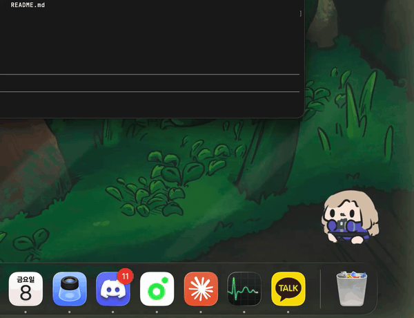

# GifCat

> A macOS menu bar app that plays your GIF / APNG at a speed driven by CPU / RAM usage.

Inspired by [RunCat](https://github.com/takayoshiotake/RunCat_for_macOS) — load **any** GIF or APNG you want, and the animation accelerates as your system gets busier.



---

## Download

**[⬇ Download GifCat v1.2.0](https://github.com/Joseng8908/gifmon/releases/latest)**

1. Download `GifCat.zip` from the link above and unzip it.
2. Move `GifCat.app` to your **Applications** folder.
3. Because the binary is ad-hoc signed (not notarized), macOS Gatekeeper will block it on first launch. Run this once in Terminal:
   ```bash
   xattr -d com.apple.quarantine /Applications/GifCat.app
   ```
4. Double-click `GifCat.app` — done.

> **macOS 13 Ventura or later** required (tested on macOS 26).

---

## Features

- **Adaptive speed** — frame rate scales live with CPU / RAM usage
- **Resource link toggle** — turn adaptive speed on/off; when off, use a separate fixed FPS setting
- **Speed customization** — set your own min / max FPS from the menu bar
- **GIF & APNG support** — works with `.gif`, `.png`, and `.apng` files
- **Multiple overlays** — add several GIF/APNG overlays at once
- **Animated menu bar icon** — use a GIF/APNG as the status bar icon, RunCat-style
- **Transparent overlay** — always-on-top, click-through window that follows you across every Space
- **Bring your own GIF** — no bundled images; drop any GIF/APNG onto the onboarding screen
- **Configurable monitoring** — track CPU, RAM, or `max(CPU, RAM)`
- **Resizable overlay** — use preset sizes or edit mode corner handles
- **Drag to reposition** — enable Edit Mode from the menu, then drag overlays anywhere
- **Launch at login** — optional auto-start on macOS login

---

## Usage

1. **First launch** — an onboarding panel appears in the center of the screen.
2. **Load a file** — drag a `.gif` or `.apng` file onto the panel, or click **GIF 선택하기**.
3. The animation appears as a transparent overlay on your desktop.
4. Animation **speeds up / slows down** automatically as your CPU or RAM usage changes.
5. All settings are accessible from the **menu bar icon** (click the `cpu` symbol).

### Menu reference

```
CPU: 45% | RAM: 62%          ← live stats (read-only)
────────────────────
모니터링 대상
  ● CPU
  ○ RAM
  ○ CPU + RAM (max)
리소스 연동                  ← toggle adaptive speed
────────────────────
속도 ▸
  최소 속도 (유휴 시)
    ● 5 fps
    ○ 10 fps
    ○ 15 fps
    ○ 20 fps
  ─────────────────
  최대 속도 (최대 부하 시)
    ○ 20 fps
    ● 30 fps
    ○ 60 fps
  ─────────────────
  고정 속도 (연동 OFF)
    ○ 5 fps
    ○ 10 fps
    ● 15 fps
    ○ 20 fps
    ○ 30 fps
    ○ 60 fps
────────────────────
크기
  ○ 작게  (0.5×)
  ● 보통  (1×)
  ○ 크게  (1.5×)
────────────────────
메뉴바 아이콘
  메뉴바 애니메이션        ☐
  메뉴바 GIF 선택...
  메뉴바 아이콘 초기화
────────────────────
GIF 추가...                  ← add one or more GIF/APNG files
전체 GIF 다시 시작           ← restart every GIF from frame 1 for sync
전체 GIF 교체...             ← replace all active overlays
모든 GIF 제거
위치 초기화                  ← reset overlay to default position
────────────────────
편집 모드             ☐      ← drag, resize, or delete individual overlays
로그인 시 자동 실행   ☐
────────────────────
상단바에서 숨기기            ← remove the menu bar entry until the app is reopened
종료
```

`상단바에서 숨기기` removes GifCat's menu bar icon for the current running session. To bring the menu back, launch GifCat again from Applications, Finder, Spotlight, or Xcode.

---

## Build from Source

```bash
git clone https://github.com/Joseng8908/gifmon.git
cd gifmon
open GifCat.xcodeproj
```

Press **⌘R** in Xcode to build and run.

---

## Architecture

```
AppDelegate
├── ResourceMonitor               CPU & RAM sampling every 0.5 s (mach API)
│     CPUSampler                  host_processor_info tick-delta wrapper
├── [ManagedGIFOverlay] × N       one record per active overlay
│     GIFController               ImageIO frame decode · DispatchSourceTimer
│     OverlayWindowController     transparent floating NSWindow · CALayer rendering
│       OverlayContentView        edit-mode drag/resize · frame persistence
├── GIFController? (menu bar)     optional animator for the status bar icon
├── StatusBarController           NSStatusItem · live label · all menu actions
└── OnboardingWindowController    first-run panel · NSDraggingDestination
```

### Speed mapping

```swift
// usage: 0.0 (idle) → 1.0 (full load)
// minFPS / maxFPS are user-configurable (default 5 / 30)
frameInterval = (1/minFPS) - usage × (1/minFPS - 1/maxFPS)
```

The default range is 5 fps (idle) → 30 fps (full load). Raise the minimum in the **속도** menu if the animation feels too slow at low usage.

### CPU sampling

Uses `host_processor_info(PROCESSOR_CPU_LOAD_INFO)` to read per-core tick counters, then computes `(Δuser + Δsys) / Δtotal` across all cores — the same method Activity Monitor uses.

### RAM sampling

Uses `host_statistics64(HOST_VM_INFO64)`.  
Reported usage = `(total − free − inactive) / total` (inactive pages treated as available by default).

---

## Requirements

| | |
|---|---|
| **Platform** | macOS 13 Ventura or later |
| **Sandbox** | Disabled (required for `host_processor_info` mach API) |
| **Code signing** | Ad-hoc |

---

## License

MIT — see [LICENSE](LICENSE).

---

## Credits

- Demo character: [Anima Engine](https://animaengine.com)
